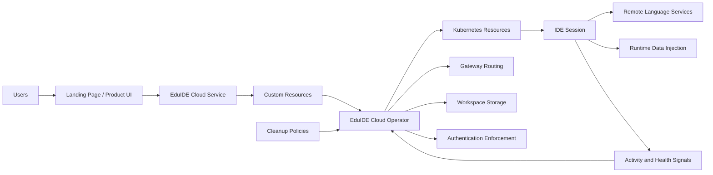

# Architecture

EduIDE is a cloud-native platform for running browser-based IDE sessions on demand. The core architectural idea is that users do not connect to one long-lived shared IDE server. Instead, the platform creates isolated, user-bound sessions inside Kubernetes and manages their lifecycle from launch to shutdown.

The architecture is therefore centered around orchestration, routing, authentication, storage, and lifecycle management rather than around a single application process.

## Architectural Layers

At a high level, the platform can be understood in five layers:

1. **Experience Layer**
   Users interact with a landing page, launch flows, and browser-based IDE sessions.
2. **Control Layer**
   EduIDE Cloud exposes the API through which sessions are requested and managed.
3. **Reconciliation Layer**
   The EduIDE Cloud operator watches desired state and turns it into concrete Kubernetes resources.
4. **Execution Layer**
   Kubernetes runs the session workloads, networking resources, storage attachments, and supporting infrastructure.
5. **Integration and Operations Layer**
   Authentication, remote language tooling, runtime data injection, observability, and cleanup complete the platform.

## System View

## EduIDE Cloud: Service and Operator

The most important architectural split inside EduIDE Cloud is between the **service** and the **operator**.

### Service

The service is the API-facing component. It accepts requests such as launching a session, stopping a session, or listing available session types. It operates on platform concepts rather than raw Kubernetes objects.

Its role is to express **desired state**. Instead of directly creating Deployments or routes, it creates or updates custom resources that describe what should exist.

This is important because it gives the rest of the platform a stable API boundary:

- frontends call the service
- integrations call the service
- the service describes platform intent
- Kubernetes implementation details stay behind that boundary

### Operator

The operator is the reconciliation engine. It watches the custom resources produced by the service and turns them into actual Kubernetes objects such as workloads, Services, routing resources, configuration, and storage bindings.

Conceptually:

- the **service** says what should run
- the **operator** makes the cluster converge on that state

This split is essential in a dynamic session platform. API handling and Kubernetes reconciliation are different concerns, and combining them would make the system harder to evolve and harder to reason about.

## Custom Resources as the Core Abstraction

EduIDE Cloud uses custom resources so the platform can be described in domain terms instead of raw infrastructure terms.

The most important high-level resources are:

- **App Definitions**
  Describe a launchable session type, including image, resources, limits, timeouts, and routing context.
- **Workspaces**
  Represent the user’s durable working context and storage relationship.
- **Sessions**
  Represent the live, running IDE instance for a specific user.

These abstractions matter because they separate three concerns cleanly:

- what the product wants to happen
- what the platform understands as a domain
- what Kubernetes actually needs in order to run it

Without them, every consumer of the platform would need deep knowledge of Deployments, Services, routes, secrets, volumes, and cleanup logic.

## Workspace and Session Model

One of the most important concepts in the architecture is the distinction between a **workspace** and a **session**.

- A **workspace** is the durable context around a user and their files.
- A **session** is the live runtime that exposes the IDE in the browser.

This separation allows the platform to treat compute as disposable while still preserving user state. In practice, that means a session can be restarted, replaced, or removed without implying that the user’s entire working context must disappear with it.

That is a critical property for educational systems:

- students need continuity of work
- operators need disposable runtime infrastructure

## What Kubernetes Does for EduIDE

Kubernetes is not just a hosting target. It is the execution substrate that gives EduIDE most of its operational properties.

At a high level, the cluster is responsible for:

- **Scheduling**
  Deciding where session workloads run.
- **Isolation**
  Keeping many user sessions separated from each other.
- **Networking**
  Giving dynamically created sessions controlled reachability.
- **Storage binding**
  Attaching the right persistent volumes to the right workspaces.
- **Recovery**
  Recreating failed workloads when nodes or pods disappear.
- **Policy enforcement**
  Applying quotas, limits, and lifecycle constraints.
- **Scalability**
  Handling bursts of many launches in a short time window.

The architectural value of Kubernetes in EduIDE is therefore repeatable control over a large number of short-lived, user-specific workloads.

## Routing and Gateway Layer

Each session needs a reachable URL, but access must remain tied to the correct session and user. This is where the routing layer becomes central.

In current EduIDE Cloud deployments, session traffic is configured dynamically through Gateway API resources and an Envoy-based gateway setup. The operator creates or updates these routing resources as part of session reconciliation.

The routing layer solves four core problems:

- directing requests to the correct live session
- handling dynamically created endpoints
- preserving required request context for the IDE application
- enforcing controlled access to user-bound sessions

This is one of the reasons a plain static ingress model is not enough. The platform needs routing that changes as sessions appear and disappear.

## Authentication and Ownership

Authentication is not only a product concern in EduIDE. It is part of the runtime architecture because every session is user-bound and access must be enforced at the delivery layer.

At a high level, the authentication layer is responsible for:

- identifying the requesting user
- connecting that user identity to launched sessions
- ensuring only the allowed user can reach a given session endpoint
- supporting protected access to dynamically provisioned IDE URLs

The important architectural point is that authentication is integrated into session lifecycle and session exposure, not bolted on afterward.

## Runtime Extensions and Supporting Components

The IDE session is not expected to contain every platform capability internally. Several important concerns are intentionally handled by cooperating components.

### Remote language services

Language-server functionality can be provided from outside the session rather than running every heavy language service directly inside each user container. This reduces per-session overhead and makes centralized language infrastructure possible.

### Runtime data injection

Some configuration values only exist at runtime, especially in cases where sessions are prewarmed or where data is user-specific. Runtime data injection makes it possible to start from reusable images and attach dynamic configuration later.

This matters for:

- personalized runtime settings
- short-lived credentials
- prewarmed sessions that cannot be fully specialized at deployment creation time

### Activity tracking and monitoring

Session activity is not only useful for observability dashboards. It also supports lifecycle decisions such as inactivity handling and session shutdown.

## On-Demand and Prewarmed Sessions

EduIDE Cloud supports both lazy and eager session handling models.

- **On-demand sessions** are created when a user explicitly launches them.
- **Prewarmed sessions** are started ahead of demand to reduce startup time.

This is not a minor optimization. It is an architectural response to classroom behavior. In teaching environments, many users often start sessions within the same short time window, which puts heavy pressure on startup latency and cluster capacity.

Prewarming helps the platform absorb those bursts more gracefully, but it also introduces architectural requirements such as runtime data injection and careful generic session preparation.

## Storage at a High Level

EduIDE treats storage differently from live runtime compute.

- live session containers should be replaceable
- user work should survive ordinary session churn

That means storage is attached to the workspace model rather than treated as a side effect of a single running pod. This separation is one of the main reasons the platform can balance usability and operability at the same time.

## Operational Concerns That Shape the Architecture

Some concerns are technically operational but architecturally fundamental because they influence how the whole system must be designed.

### Cleanup

Sessions and workspaces cannot accumulate forever. Cleanup is not optional in a multi-user cloud IDE platform because stale resources directly consume storage, addresses, and cluster capacity.

### Observability

The platform must expose enough signals to answer questions such as:

- Are sessions starting successfully?
- Where are launches slow?
- Which workloads are idle or stuck?
- Is a classroom spike overwhelming the cluster?

### Scale validation

The system has to be validated not just for correctness, but also for synchronized demand. A launch flow that works for individual developers may fail under a course exercise release when many sessions start at once.

## End-to-End Flow

From a runtime perspective, the flow looks like this:

1. A user authenticates and requests a session from the UI.
2. The UI calls the EduIDE Cloud service.
3. The service creates or updates custom resources describing the requested state.
4. The operator reconciles those resources into workloads, routes, services, and storage bindings.
5. Kubernetes schedules the session and the gateway layer exposes it.
6. Authentication and runtime integrations complete the user-specific execution context.
7. Activity, health, and lifecycle policies govern the session until it is shut down or cleaned up.

## Design Principles

The platform follows a few core architectural principles:

- **Separate intent from execution**
  API handling and cluster reconciliation are distinct concerns.
- **Use domain abstractions**
  Sessions, workspaces, and app definitions are first-class platform concepts.
- **Keep runtime compute disposable**
  Live session containers should be replaceable without losing the user’s whole context.
- **Treat auth and routing as core platform features**
  They are part of session delivery, not optional add-ons.
- **Design for bursty, synchronized demand**
  Educational traffic patterns shape the architecture directly.
- **Push specialization to runtime when needed**
  Reusable images combined with dynamic configuration are more scalable than fully personalized images.

## Summary

EduIDE is best understood as a Kubernetes-based session orchestration platform. Its architecture is defined less by individual codebases and more by the interaction between the EduIDE Cloud service, the operator, the custom resources, the cluster, and the runtime integration layer. Together, these components allow the platform to create secure, isolated, and scalable browser-based development environments for many users at once.
